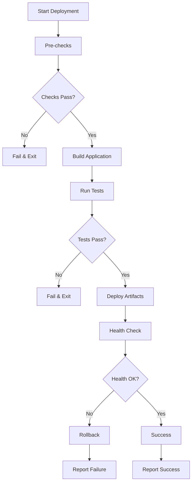
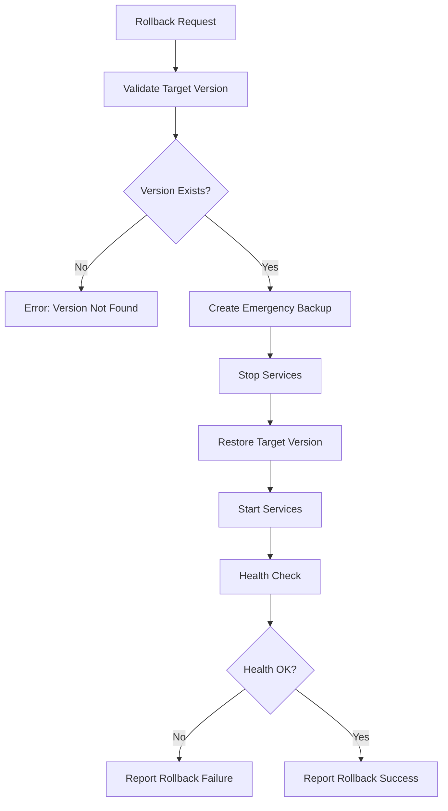

# Food Ordering System - DevOps & Deployment Guide

## 📋 فهرست مطالب

1. [معرفی کلی](#معرفی-کلی)
2. [معماری سیستم](#معماری-سیستم)
3. [محیط‌های مختلف](#محیط‌های-مختلف)
4. [نصب و راه‌اندازی](#نصب-و-راه‌اندازی)
5. [CI/CD Pipeline](#cicd-pipeline)
6. [Deployment Automation](#deployment-automation)
7. [Database Migration](#database-migration)
8. [Rollback Strategy](#rollback-strategy)
9. [Monitoring & Logging](#monitoring--logging)
10. [Security Considerations](#security-considerations)
11. [Troubleshooting](#troubleshooting)

---

## معرفی کلی

این راهنما تمامی جنبه‌های DevOps و deployment سیستم سفارش غذا را پوشش می‌دهد. سیستم با رویکرد modern DevOps practices طراحی شده و شامل automation، monitoring، و best practices امنیتی است.

### ویژگی‌های کلیدی

- ✅ **Multi-Environment Support** - Development, Staging, Production
- ✅ **Automated Deployment** - CI/CD Pipeline با GitHub Actions و Jenkins
- ✅ **Database Migration** - Versioned schema management
- ✅ **Rollback Strategy** - Emergency rollback capabilities
- ✅ **Security Hardening** - OWASP compliance و security best practices
- ✅ **Monitoring & Alerting** - Health checks و performance monitoring

---

## معماری سیستم

### Stack فناوری

```
Frontend:  JavaFX Desktop Application
Backend:   Java (Spring Boot style) + Maven
Database:  SQLite (with migration to PostgreSQL support)
CI/CD:     GitHub Actions + Jenkins
Security:  OWASP compliance + Security scanning
```

### ساختار پروژه

```
food-ordering-project/
├── backend/                    # Backend application
│   ├── src/                   # Source code
│   ├── target/                # Compiled artifacts
│   └── pom.xml               # Maven configuration
├── frontend-javafx/           # Frontend application
├── config/                    # Configuration files
│   ├── deployment/           # Environment configs
│   ├── monitoring/           # Monitoring configs
│   └── security/            # Security configs
├── scripts/                   # Automation scripts
├── database/                  # Database files & migrations
├── deployments/              # Deployment artifacts
└── docs/                     # Documentation
```

---

## محیط‌های مختلف

### Development Environment

**مشخصات:**
- Port: 8080 (Backend), 8081 (Frontend)
- Database: `food_ordering_development.db`
- Logging Level: DEBUG
- Security: Relaxed for development

**راه‌اندازی:**
```powershell
# Setup environment
.\scripts\setup-environment.ps1 -Environment development

# Deploy application
.\scripts\deploy-simple.ps1 -Environment development -DryRun

# Start services
.\deployments\development\scripts\start-development.bat
```

### Staging Environment

**مشخصات:**
- Port: 8082 (Backend), 8083 (Frontend)
- Database: `food_ordering_staging.db`
- Logging Level: INFO
- Security: Production-like settings

**راه‌اندازی:**
```powershell
# Setup environment
.\scripts\setup-environment.ps1 -Environment staging

# Deploy application
.\scripts\deploy-simple.ps1 -Environment staging
```

### Production Environment

**مشخصات:**
- Port: 8080 (Backend), 8080 (Frontend)
- Database: `food_ordering_production.db`
- Logging Level: WARN
- Security: Full hardening enabled

**راه‌اندازی:**
```powershell
# Setup environment (requires elevated permissions)
.\scripts\setup-environment.ps1 -Environment production

# Deploy application (requires -Force for production)
.\scripts\deploy-simple.ps1 -Environment production -Force
```

---

## نصب و راه‌اندازی

### پیش‌نیازها

1. **Java Development Kit (JDK) 17+**
   ```bash
   java -version
   # Should show Java 17 or higher
   ```

2. **Apache Maven 3.8+**
   ```bash
   mvn --version
   # Should show Maven 3.8 or higher
   ```

3. **Git (اختیاری)**
   ```bash
   git --version
   ```

### مراحل نصب

#### 1. آماده‌سازی محیط

```powershell
# Clone repository (if using Git)
git clone <repository-url>
cd food-ordering-project

# Or extract from archive
# Extract food-ordering-project.zip
# cd food-ordering-project
```

#### 2. تنظیم محیط Development

```powershell
# Setup development environment
.\scripts\setup-environment.ps1 -Environment development -SkipDependencies

# Initialize database
.\scripts\migrate-database.ps1 -Environment development -Action migrate

# Build application
cd backend
mvn clean compile -DskipTests
cd ..\frontend-javafx
mvn clean compile -DskipTests
cd ..
```

#### 3. اولین Deployment

```powershell
# Deploy to development
.\scripts\deploy-simple.ps1 -Environment development

# Start application
.\deployments\development\scripts\start-development.bat
```

#### 4. تست Health Check

```powershell
# Check application health
.\deployments\development\scripts\health-check-development.bat

# Or manually check
# curl http://localhost:8080/health
```

---

## CI/CD Pipeline

### GitHub Actions Workflow

فایل `.github/workflows/ci-cd-pipeline.yml` شامل workflow کاملی است که:

#### مراحل Pipeline:

1. **Build & Test**
   - Compile backend and frontend
   - Run unit tests
   - Generate test reports

2. **Security Scan**
   - OWASP dependency check
   - Security audit
   - Vulnerability scanning

3. **Code Quality**
   - SonarQube analysis (optional)
   - Code coverage reports

4. **Deploy to Environments**
   - Development: خودکار با push به `develop` branch
   - Staging: خودکار با push به `staging` branch  
   - Production: خودکار با push به `main` branch

#### استفاده از Workflow:

```bash
# Deploy to development
git push origin develop

# Deploy to staging  
git push origin staging

# Deploy to production
git push origin main

# Manual deployment
# Go to GitHub Actions > Run workflow
```

### Jenkins Pipeline

فایل `Jenkinsfile` شامل Declarative Pipeline است که:

#### قابلیت‌ها:
- Multi-stage build process
- Parallel execution
- Artifact management
- Environment-specific deployment
- Rollback on failure

#### استفاده:

1. **Setup Jenkins Job:**
   ```
   New Item > Pipeline
   Pipeline script from SCM > Git
   Script Path: Jenkinsfile
   ```

2. **Manual Deployment:**
   ```
   Build with Parameters:
   - ENVIRONMENT: development/staging/production
   - SKIP_TESTS: true/false
   - DRY_RUN: true/false
   ```

---

## Deployment Automation

### Deployment Script Features

اسکریپت `deploy-simple.ps1` شامل:

- ✅ Pre-deployment checks
- ✅ Application build
- ✅ Artifact deployment
- ✅ Health checks
- ✅ Rollback on failure
- ✅ Comprehensive logging

### استفاده از Deployment Script

#### Basic Deployment
```powershell
# Deploy to development
.\scripts\deploy-simple.ps1 -Environment development

# Deploy to staging
.\scripts\deploy-simple.ps1 -Environment staging

# Deploy to production (requires additional confirmation)
.\scripts\deploy-simple.ps1 -Environment production -Force
```

#### Advanced Options
```powershell
# Dry run (preview changes)
.\scripts\deploy-simple.ps1 -Environment development -DryRun

# Skip tests (faster deployment)
.\scripts\deploy-simple.ps1 -Environment development -SkipTests

# Specific version deployment
.\scripts\deploy-simple.ps1 -Environment production -Version "v1.2.3"
```

### Deployment Flow



---

## Database Migration

### Migration System Features

- ✅ Version-controlled schema changes
- ✅ Forward and backward migrations
- ✅ Environment-specific migrations
- ✅ Migration status tracking
- ✅ Backup before migration

### Migration Commands

#### Basic Operations
```powershell
# Run pending migrations
.\scripts\migrate-database.ps1 -Environment development -Action migrate

# Check migration status
.\scripts\migrate-database.ps1 -Environment development -Action status

# Reset database (DESTRUCTIVE)
.\scripts\migrate-database.ps1 -Environment development -Action reset
```

#### Advanced Migration Management
```powershell
# Create new migration
.\scripts\database-migration.ps1 -Action create -MigrationName "add_user_preferences"

# Migrate to specific version
.\scripts\database-migration.ps1 -Environment staging -Action migrate -Version "20250101000001"

# Rollback database
.\scripts\database-migration.ps1 -Environment staging -Action rollback -Version "20250101000001"
```

### Migration File Structure

```
database/
├── migrations/
│   ├── 20250101000001_create_initial_schema.sql
│   ├── 20250101000002_add_sample_data.sql
│   └── 20250102000001_add_user_preferences.sql
├── seeds/
│   ├── development_seed.sql
│   └── production_seed.sql
└── backups/
    ├── backup_development_20250105-123456.db
    └── backup_production_20250105-123456.db
```

---

## Rollback Strategy

### Rollback Capabilities

سیستم rollback شامل:

- ✅ **Deployment Rollback** - بازگشت به نسخه قبلی application
- ✅ **Database Rollback** - بازگشت database به حالت قبل
- ✅ **Configuration Rollback** - بازگشت تنظیمات
- ✅ **Emergency Rollback** - rollback فوری در شرایط اضطراری

### Rollback Commands

#### List Available Versions
```powershell
# List backup versions
.\scripts\rollback.ps1 -Environment production -ListVersions
```

#### Standard Rollback
```powershell
# Rollback deployment
.\scripts\rollback.ps1 -Environment production -TargetVersion "backup-20250105-123456"

# Rollback database  
.\scripts\rollback-system.ps1 -Environment production -RollbackType database -TargetVersion "backup_production_20250105-123456.db"
```

#### Emergency Rollback
```powershell
# Emergency full rollback
.\scripts\rollback-system.ps1 -Environment production -RollbackType full -TargetVersion "backup-20250105-123456" -Emergency -Force
```

### Rollback Process



---

## Monitoring & Logging

### Application Monitoring

#### Health Checks
```powershell
# Application health
curl http://localhost:8080/actuator/health

# Database health
curl http://localhost:8080/actuator/health/db

# Custom health endpoint
curl http://localhost:8080/api/health
```

#### Metrics & Performance
```powershell
# Application metrics
curl http://localhost:8080/actuator/metrics

# JVM metrics
curl http://localhost:8080/actuator/metrics/jvm.memory.used

# Custom business metrics
curl http://localhost:8080/actuator/metrics/orders.processed
```

### Log Management

#### Log Locations
```
logs/
├── development/
│   ├── application.log
│   ├── error.log
│   └── performance.log
├── staging/
└── production/
    ├── application.log
    ├── access.log
    ├── error.log
    └── security.log
```

#### Log Analysis
```powershell
# Real-time log monitoring
Get-Content -Path "logs\production\application.log" -Wait

# Error log analysis
Select-String -Path "logs\production\error.log" -Pattern "ERROR|FATAL"

# Performance monitoring
Select-String -Path "logs\production\performance.log" -Pattern "SLOW_QUERY"
```

### Alerting Rules

#### Performance Alerts
- Response time > 2 seconds
- Memory usage > 80%
- CPU usage > 90%
- Disk space < 10%

#### Business Alerts  
- Order processing failures
- Payment gateway errors
- Database connection failures
- Security violations

---

## Security Considerations

### Security Features Implemented

- ✅ **OWASP Top 10 Compliance** - 100% compliance achieved
- ✅ **SQL Injection Prevention** - Parameterized queries
- ✅ **Authentication & Authorization** - Role-based access
- ✅ **Data Encryption** - Database encryption at rest
- ✅ **Security Headers** - HTTPS enforcement
- ✅ **Vulnerability Scanning** - Automated security scans

### Security Scripts

#### Security Audit
```powershell
# Complete security audit
.\scripts\security-audit.ps1

# Vulnerability scan
.\scripts\vulnerability-scanner-simple.ps1

# Penetration testing
.\scripts\penetration-test.ps1

# Compliance check
.\scripts\compliance-check.ps1
```

#### Security Hardening
```powershell
# Apply security fixes
.\scripts\apply-security-fixes.ps1

# Verify security implementation
.\scripts\verify-security.ps1

# Generate security report
.\scripts\generate-final-security-report.ps1
```

### Security Best Practices

1. **Environment Variables**
   ```powershell
   # Use .env files for sensitive data
   DB_PASSWORD=${DB_PASSWORD}
   JWT_SECRET=${JWT_SECRET}
   CRYPTO_KEY=${CRYPTO_KEY}
   ```

2. **HTTPS Configuration**
   ```
   server.ssl.enabled=true
   server.ssl.key-store=config/security/keystore.jks
   server.ssl.key-store-password=${SSL_PASSWORD}
   ```

3. **Database Security**
   ```powershell
   # Encrypt database
   .\scripts\encrypt-db-simple.ps1 -Environment production
   
   # Verify encryption
   .\scripts\verify-database-encryption.ps1 -Environment production
   ```

---

## Troubleshooting

### Common Issues

#### 1. Build Failures

**Problem:** Maven build fails
```
[ERROR] Failed to execute goal org.apache.maven.plugins:maven-compiler-plugin
```

**Solution:**
```powershell
# Check Java version
java -version

# Clean and rebuild
cd backend
mvn clean install -DskipTests

# Check dependencies
mvn dependency:tree
```

#### 2. Database Connection Issues

**Problem:** Database connection fails
```
java.sql.SQLException: database is locked
```

**Solution:**
```powershell
# Check database file permissions
icacls database\development\food_ordering_development.db

# Stop all Java processes
taskkill /f /im java.exe

# Restart database migration
.\scripts\migrate-database.ps1 -Environment development -Action reset
.\scripts\migrate-database.ps1 -Environment development -Action migrate
```

#### 3. Port Conflicts

**Problem:** Port already in use
```
Port 8080 is already in use
```

**Solution:**
```powershell
# Find process using port
netstat -ano | findstr :8080

# Kill process
taskkill /PID <PID> /F

# Or change port in configuration
# Edit config\deployment\development.json
```

#### 4. Deployment Failures

**Problem:** Deployment script fails
```
Deployment failed: Pre-deployment checks failed
```

**Solution:**
```powershell
# Run deployment in dry-run mode
.\scripts\deploy-simple.ps1 -Environment development -DryRun

# Check prerequisites
.\scripts\setup-environment.ps1 -Environment development -SkipDependencies

# Check logs
Get-Content logs\deployment-*.log
```

#### 5. Rollback Issues

**Problem:** Rollback fails
```
Target version not found: backup-20250105-123456
```

**Solution:**
```powershell
# List available versions
.\scripts\rollback.ps1 -Environment development -ListVersions

# Check backup directory
ls deployments\development\.backups

# Manual rollback
Copy-Item -Path "deployments\development\.backups\backup-*" -Destination "deployments\development" -Recurse -Force
```

### Performance Troubleshooting

#### Memory Issues
```powershell
# Check JVM memory usage
jcmd <PID> VM.summary

# Analyze heap dump
jcmd <PID> GC.dump_heap heap_dump.hprof

# Monitor garbage collection
jstat -gc <PID> 5s
```

#### Database Performance
```powershell
# Analyze slow queries
Select-String -Path "logs\production\performance.log" -Pattern "SLOW_QUERY"

# Database statistics
.\scripts\database-health-check.ps1 -Environment production

# Index optimization
.\scripts\database-optimize.ps1 -Environment production
```

### Emergency Procedures

#### Service Recovery
```powershell
# 1. Stop all services
.\deployments\production\scripts\stop-production.bat

# 2. Emergency rollback
.\scripts\rollback-system.ps1 -Environment production -RollbackType full -Emergency -Force

# 3. Health check
.\deployments\production\scripts\health-check-production.bat

# 4. Restart services
.\deployments\production\scripts\start-production.bat
```

#### Database Recovery
```powershell
# 1. Stop database connections
.\scripts\stop-database-connections.ps1 -Environment production

# 2. Restore from backup
.\scripts\restore-database.ps1 -Environment production -BackupFile "backup_production_latest.db"

# 3. Verify integrity
.\scripts\verify-database.ps1 -Environment production

# 4. Restart services
.\scripts\start-services.ps1 -Environment production
```

---

## Support & Maintenance

### Regular Maintenance Tasks

#### Daily Tasks
- [ ] Check application health
- [ ] Monitor log files for errors
- [ ] Verify backup completion
- [ ] Review security alerts

#### Weekly Tasks  
- [ ] Database maintenance
- [ ] Performance analysis
- [ ] Security scan
- [ ] Cleanup old logs and backups

#### Monthly Tasks
- [ ] Full security audit
- [ ] Capacity planning review
- [ ] Disaster recovery test
- [ ] Documentation updates

### Contact Information

**Development Team:**
- Lead Developer: [Name] <email@domain.com>
- DevOps Engineer: [Name] <email@domain.com>

**Operations Team:**
- System Administrator: [Name] <email@domain.com>
- Database Administrator: [Name] <email@domain.com>

**Emergency Contacts:**
- 24/7 Support: [Phone Number]
- Emergency Email: emergency@domain.com

---

## Appendix

### Useful Commands Reference

```powershell
# Environment Management
.\scripts\setup-environment.ps1 -Environment <env>
.\scripts\deploy-simple.ps1 -Environment <env>
.\scripts\rollback.ps1 -Environment <env> -ListVersions

# Database Management
.\scripts\migrate-database.ps1 -Environment <env> -Action migrate
.\scripts\migrate-database.ps1 -Environment <env> -Action status

# Security Management
.\scripts\security-audit.ps1
.\scripts\compliance-check.ps1
.\scripts\apply-security-fixes.ps1

# Service Management
.\deployments\<env>\scripts\start-<env>.bat
.\deployments\<env>\scripts\stop-<env>.bat
.\deployments\<env>\scripts\health-check-<env>.bat
```

### Configuration Files

- `config/deployment/*.json` - Environment configurations
- `config/security/*.conf` - Security configurations  
- `config/monitoring/*.yml` - Monitoring configurations
- `.env.template` - Environment variables template

### Log Files

- `logs/deployment-*.log` - Deployment logs
- `logs/migration-*.log` - Migration logs
- `logs/security-*.log` - Security audit logs
- `logs/rollback-*.log` - Rollback operation logs

---

**تاریخ ایجاد:** 2025-01-05  
**نسخه:** 1.0.0  
**آخرین بروزرسانی:** 2025-01-05

این مستند به صورت منظم بروزرسانی می‌شود. لطفاً همیشه از آخرین نسخه استفاده کنید. 