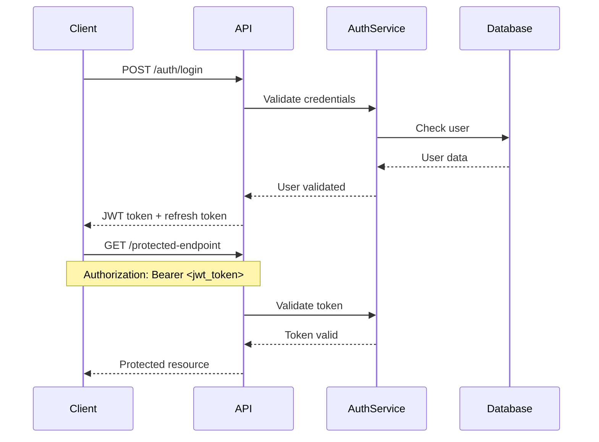

# 🔌 API Specifications Documentation

> **مستندات کامل API و نحوه ارتباط با سیستم سفارش غذا**

---

## 📋 فهرست مطالب

1. [Overview](#overview)
2. [Authentication](#authentication)
3. [Request/Response Format](#request-response-format)
4. [Error Handling](#error-handling)
5. [Rate Limiting](#rate-limiting)
6. [API Endpoints](#api-endpoints)
7. [Data Models](#data-models)
8. [Security](#security)

---

## 🎯 Overview

### API Design Principles
- **RESTful Architecture**: Resource-based URLs
- **HTTP Methods**: GET, POST, PUT, DELETE
- **JSON Format**: All requests and responses in JSON
- **Stateless**: No server-side sessions
- **Versioning**: URL-based versioning (/api/v1/)

### Base URL
```
Production: https://api.food-ordering.com/api/v1
Development: http://localhost:8080/api/v1
```

### Content Types
```
Request: application/json
Response: application/json
Character Encoding: UTF-8
```

---

## 🔐 Authentication

### JWT Token Authentication
```http
Authorization: Bearer <jwt_token>
```

### Authentication Flow


### Token Specifications
```yaml
Access Token:
  Algorithm: HS256
  Expiration: 24 hours
  Claims: user_id, role, permissions, exp, iat

Refresh Token:
  Algorithm: HS256
  Expiration: 30 days
  Claims: user_id, token_type, exp, iat
```

---

## 📦 Request/Response Format

### Standard Response Format
```json
{
  "success": true,
  "data": { ... },
  "message": "عملیات موفقیت‌آمیز بود",
  "timestamp": "2024-11-20T10:30:00Z",
  "pagination": {
    "page": 1,
    "limit": 10,
    "total": 100,
    "hasNext": true,
    "hasPrevious": false
  }
}
```

### Error Response Format
```json
{
  "success": false,
  "error": {
    "code": "VALIDATION_ERROR",
    "message": "خطا در اعتبارسنجی داده‌ها",
    "details": [
      {
        "field": "email",
        "message": "فرمت ایمیل نامعتبر است"
      }
    ]
  },
  "timestamp": "2024-11-20T10:30:00Z"
}
```

---

## ⚠️ Error Handling

### HTTP Status Codes
```yaml
Success:
  200: OK - موفقیت‌آمیز
  201: Created - ایجاد شده
  202: Accepted - پذیرفته شده
  204: No Content - بدون محتوا

Client Errors:
  400: Bad Request - درخواست نامعتبر
  401: Unauthorized - عدم احراز هویت
  403: Forbidden - عدم دسترسی
  404: Not Found - یافت نشد
  409: Conflict - تداخل داده
  422: Unprocessable Entity - خطا در پردازش
  429: Too Many Requests - تعداد درخواست زیاد

Server Errors:
  500: Internal Server Error - خطای داخلی سرور
  502: Bad Gateway - خطای گیت‌وی
  503: Service Unavailable - سرویس در دسترس نیست
```

### Error Codes
```yaml
Authentication:
  AUTH_001: Invalid credentials
  AUTH_002: Token expired
  AUTH_003: Token invalid
  AUTH_004: Account locked
  AUTH_005: Account inactive

Validation:
  VAL_001: Required field missing
  VAL_002: Invalid format
  VAL_003: Value out of range
  VAL_004: Duplicate value

Business Logic:
  BIZ_001: Insufficient balance
  BIZ_002: Restaurant closed
  BIZ_003: Item unavailable
  BIZ_004: Invalid order status
  BIZ_005: Payment failed
```

---

## 🚦 Rate Limiting

### Rate Limits
```yaml
General API:
  - 100 requests per minute per user
  - 1000 requests per hour per IP

Authentication:
  - 5 login attempts per minute
  - 20 login attempts per hour

File Upload:
  - 10 uploads per minute
  - 100 MB per hour

Public Endpoints:
  - 200 requests per minute per IP
```

### Rate Limit Headers
```http
X-RateLimit-Limit: 100
X-RateLimit-Remaining: 87
X-RateLimit-Reset: 1640995200
```

---

## 📝 API Endpoints

### Authentication Endpoints

#### Register User
```http
POST /auth/register
Content-Type: application/json

{
  "username": "john_doe",
  "email": "john@example.com",
  "password": "SecurePass123!",
  "fullName": "John Doe",
  "phone": "+98912345678"
}
```

**Response:**
```json
{
  "success": true,
  "data": {
    "user": {
      "id": 123,
      "username": "john_doe",
      "email": "john@example.com",
      "fullName": "John Doe",
      "role": "CUSTOMER"
    },
    "accessToken": "eyJhbGciOiJIUzI1NiIsInR5cCI6IkpXVCJ9...",
    "refreshToken": "eyJhbGciOiJIUzI1NiIsInR5cCI6IkpXVCJ9..."
  },
  "message": "کاربر با موفقیت ثبت شد"
}
```

#### Login
```http
POST /auth/login
Content-Type: application/json

{
  "username": "john_doe",
  "password": "SecurePass123!"
}
```

#### Refresh Token
```http
POST /auth/refresh
Content-Type: application/json

{
  "refreshToken": "eyJhbGciOiJIUzI1NiIsInR5cCI6IkpXVCJ9..."
}
```

#### Logout
```http
POST /auth/logout
Authorization: Bearer <access_token>
```

### User Management Endpoints

#### Get Profile
```http
GET /users/profile
Authorization: Bearer <access_token>
```

#### Update Profile
```http
PUT /users/profile
Authorization: Bearer <access_token>
Content-Type: application/json

{
  "fullName": "John Smith",
  "phone": "+98912345678",
  "address": "Tehran, Iran"
}
```

#### Change Password
```http
POST /users/change-password
Authorization: Bearer <access_token>
Content-Type: application/json

{
  "currentPassword": "OldPass123!",
  "newPassword": "NewPass123!"
}
```

### Restaurant Endpoints

#### List Restaurants
```http
GET /restaurants?page=1&limit=10&category=pizza&sortBy=rating
```

**Response:**
```json
{
  "success": true,
  "data": [
    {
      "id": 1,
      "name": "پیتزا ایتالیایی",
      "description": "بهترین پیتزا شهر",
      "category": "pizza",
      "rating": 4.5,
      "deliveryTime": "25-35 دقیقه",
      "deliveryFee": 15000,
      "minimumOrder": 50000,
      "isOpen": true,
      "imageUrl": "https://example.com/pizza.jpg"
    }
  ],
  "pagination": {
    "page": 1,
    "limit": 10,
    "total": 25,
    "hasNext": true
  }
}
```

#### Get Restaurant Details
```http
GET /restaurants/{id}
```

#### Get Restaurant Menu
```http
GET /restaurants/{id}/menu
```

### Order Endpoints

#### Create Order
```http
POST /orders
Authorization: Bearer <access_token>
Content-Type: application/json

{
  "restaurantId": 1,
  "items": [
    {
      "foodItemId": 10,
      "quantity": 2,
      "specialInstructions": "بدون پیاز"
    }
  ],
  "deliveryAddress": "تهران، خیابان ولیعصر",
  "deliveryPhone": "+98912345678",
  "paymentMethod": "WALLET",
  "couponCode": "SAVE10"
}
```

#### Get Order History
```http
GET /orders?page=1&limit=10&status=DELIVERED
Authorization: Bearer <access_token>
```

#### Get Order Details
```http
GET /orders/{id}
Authorization: Bearer <access_token>
```

#### Cancel Order
```http
PUT /orders/{id}/cancel
Authorization: Bearer <access_token>
Content-Type: application/json

{
  "reason": "تغییر نظر"
}
```

### Payment Endpoints

#### Process Payment
```http
POST /payments/process
Authorization: Bearer <access_token>
Content-Type: application/json

{
  "orderId": 12345,
  "paymentMethod": "CARD",
  "amount": 150000,
  "gatewayData": {
    "cardNumber": "****-****-****-1234",
    "cvv": "123"
  }
}
```

#### Get Payment History
```http
GET /payments/history?page=1&limit=10
Authorization: Bearer <access_token>
```

### Wallet Endpoints

#### Get Wallet Balance
```http
GET /wallet/balance
Authorization: Bearer <access_token>
```

#### Add Funds
```http
POST /wallet/add-funds
Authorization: Bearer <access_token>
Content-Type: application/json

{
  "amount": 100000,
  "paymentMethod": "CARD"
}
```

#### Get Transaction History
```http
GET /wallet/transactions?page=1&limit=10
Authorization: Bearer <access_token>
```

### Review Endpoints

#### Submit Review
```http
POST /reviews
Authorization: Bearer <access_token>
Content-Type: application/json

{
  "orderId": 12345,
  "rating": 5,
  "comment": "غذا عالی بود!",
  "foodQualityRating": 5,
  "deliveryRating": 4,
  "serviceRating": 5
}
```

#### Get Restaurant Reviews
```http
GET /restaurants/{id}/reviews?page=1&limit=10
```

---

## 📊 Data Models

### User Model
```json
{
  "id": 123,
  "username": "john_doe",
  "email": "john@example.com",
  "fullName": "John Doe",
  "phone": "+98912345678",
  "address": "Tehran, Iran",
  "role": "CUSTOMER",
  "isActive": true,
  "emailVerified": true,
  "createdAt": "2024-01-01T10:00:00Z",
  "updatedAt": "2024-01-15T14:30:00Z"
}
```

### Restaurant Model
```json
{
  "id": 1,
  "name": "پیتزا ایتالیایی",
  "description": "بهترین پیتزا شهر",
  "category": "pizza",
  "address": "تهران، خیابان ولیعصر",
  "phone": "+982112345678",
  "rating": 4.5,
  "reviewCount": 128,
  "deliveryTime": "25-35 دقیقه",
  "deliveryFee": 15000,
  "minimumOrder": 50000,
  "isOpen": true,
  "imageUrl": "https://example.com/pizza.jpg",
  "openingHours": {
    "monday": "10:00-23:00",
    "tuesday": "10:00-23:00"
  }
}
```

### Order Model
```json
{
  "id": 12345,
  "orderNumber": "ORD-2024-001234",
  "customerId": 123,
  "restaurantId": 1,
  "status": "DELIVERED",
  "items": [
    {
      "id": 1,
      "foodItemId": 10,
      "foodItemName": "پیتزا پپرونی",
      "quantity": 2,
      "unitPrice": 85000,
      "totalPrice": 170000,
      "specialInstructions": "بدون پیاز"
    }
  ],
  "subtotal": 170000,
  "deliveryFee": 15000,
  "tax": 5100,
  "discount": 0,
  "total": 190100,
  "deliveryAddress": "تهران، خیابان ولیعصر",
  "paymentMethod": "WALLET",
  "paymentStatus": "PAID",
  "orderDate": "2024-01-15T12:00:00Z",
  "estimatedDeliveryTime": "2024-01-15T12:45:00Z",
  "deliveredAt": "2024-01-15T12:40:00Z"
}
```

### Food Item Model
```json
{
  "id": 10,
  "restaurantId": 1,
  "name": "پیتزا پپرونی",
  "description": "پیتزا با پپرونی و پنیر موتزارلا",
  "category": "pizza",
  "price": 85000,
  "imageUrl": "https://example.com/pepperoni.jpg",
  "isAvailable": true,
  "isVegetarian": false,
  "preparationTime": 20,
  "tags": ["popular", "spicy"],
  "nutritionalInfo": {
    "calories": 320,
    "protein": 15,
    "carbs": 35,
    "fat": 12
  }
}
```

---

## 🔒 Security

### Security Headers
```http
X-Content-Type-Options: nosniff
X-Frame-Options: DENY
X-XSS-Protection: 1; mode=block
Strict-Transport-Security: max-age=31536000; includeSubDomains
Content-Security-Policy: default-src 'self'
```

### Input Validation
- All inputs are validated and sanitized
- SQL injection protection via parameterized queries
- XSS protection via output encoding
- CSRF protection via tokens

### Data Protection
- Passwords hashed with BCrypt
- Sensitive data encrypted at rest
- PII data access logging
- GDPR compliance measures

---

## 🧪 Testing

### Test Endpoints
```http
GET /health
GET /health/db
GET /health/cache
```

### Sample API Calls
```bash
# Health check
curl -X GET "http://localhost:8080/health"

# Login
curl -X POST "http://localhost:8080/api/v1/auth/login" \
  -H "Content-Type: application/json" \
  -d '{"username":"test","password":"password"}'

# Get restaurants
curl -X GET "http://localhost:8080/api/v1/restaurants?page=1&limit=5"

# Create order
curl -X POST "http://localhost:8080/api/v1/orders" \
  -H "Content-Type: application/json" \
  -H "Authorization: Bearer <token>" \
  -d '{"restaurantId":1,"items":[{"foodItemId":1,"quantity":2}]}'
```

---

**نسخه**: 1.0.0
**آخرین به‌روزرسانی**: نوامبر 2024
**وضعیت**: Production Ready 