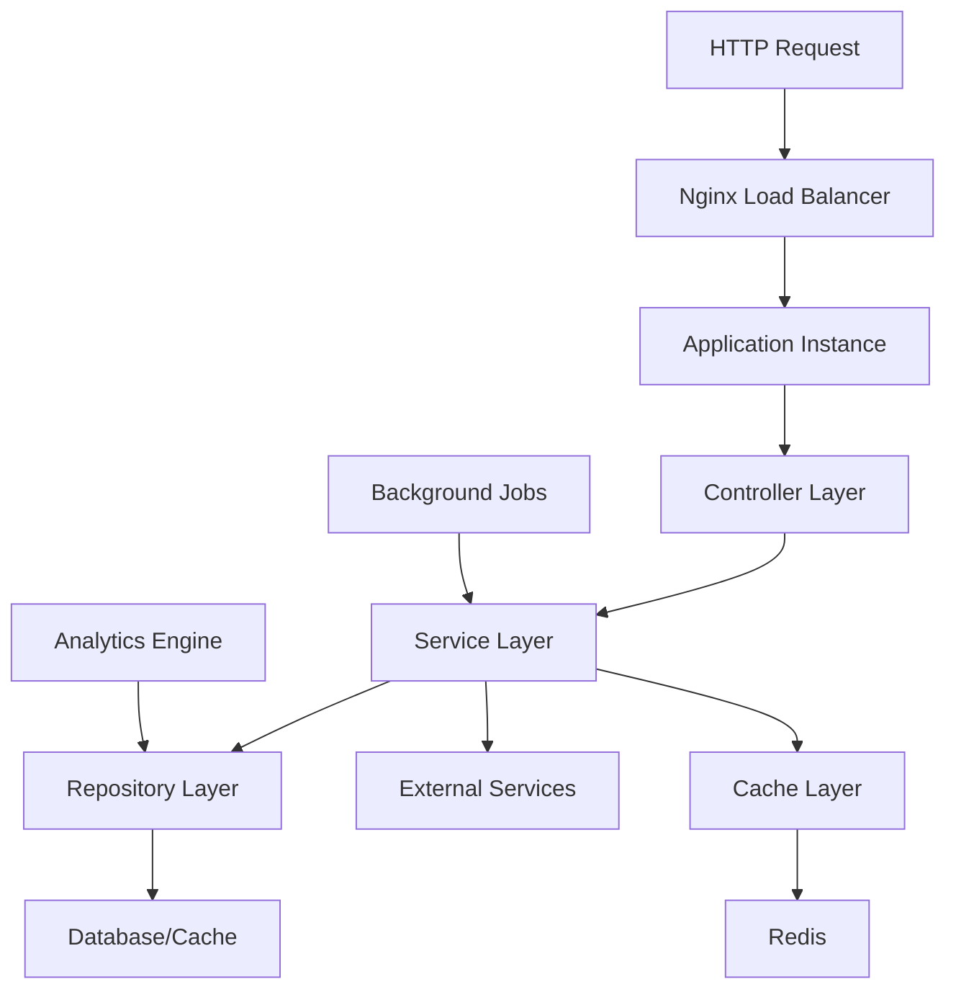
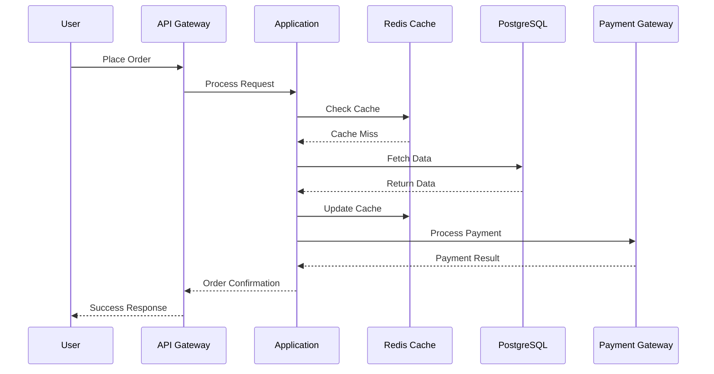

# 🏗️ Technical Architecture Documentation - Food Ordering System

> **مستندات کامل معماری فنی سیستم سفارش غذا**

---

## 📋 فهرست مطالب

1. [نمای کلی معماری](#نمای-کلی-معماری)
2. [Technology Stack](#technology-stack)
3. [Application Architecture](#application-architecture)
4. [Database Design](#database-design)
5. [API Architecture](#api-architecture)
6. [Security Architecture](#security-architecture)
7. [Performance Architecture](#performance-architecture)
8. [Deployment Architecture](#deployment-architecture)
9. [Integration Points](#integration-points)
10. [Scalability Design](#scalability-design)

---

## 🎯 نمای کلی معماری

### System Overview
سیستم سفارش غذا بر اساس معماری **Layered Architecture** طراحی شده که شامل لایه‌های زیر است:

```
┌─────────────────────────────────────────────────────────────┐
│                    PRESENTATION LAYER                       │
│  ┌─────────────┐  ┌─────────────┐  ┌─────────────────────┐  │
│  │   Web UI    │  │ Mobile App  │  │   Admin Panel       │  │
│  └─────────────┘  └─────────────┘  └─────────────────────┘  │
└─────────────────────────────────────────────────────────────┘
                              │
┌─────────────────────────────────────────────────────────────┐
│                      API GATEWAY                            │
│                   (Load Balancer)                           │
└─────────────────────────────────────────────────────────────┘
                              │
┌─────────────────────────────────────────────────────────────┐
│                  APPLICATION LAYER                          │
│  ┌─────────────┐  ┌─────────────┐  ┌─────────────────────┐  │
│  │Controllers  │  │ Services    │  │   Business Logic    │  │
│  └─────────────┘  └─────────────┘  └─────────────────────┘  │
└─────────────────────────────────────────────────────────────┘
                              │
┌─────────────────────────────────────────────────────────────┐
│                    DATA ACCESS LAYER                        │
│  ┌─────────────┐  ┌─────────────┐  ┌─────────────────────┐  │
│  │ Repositories│  │   Models    │  │      Entities       │  │
│  └─────────────┘  └─────────────┘  └─────────────────────┘  │
└─────────────────────────────────────────────────────────────┘
                              │
┌─────────────────────────────────────────────────────────────┐
│                    PERSISTENCE LAYER                        │
│  ┌─────────────┐  ┌─────────────┐  ┌─────────────────────┐  │
│  │ PostgreSQL  │  │   Redis     │  │   File Storage      │  │
│  └─────────────┘  └─────────────┘  └─────────────────────┘  │
└─────────────────────────────────────────────────────────────┘
```

### Core Principles
- **Separation of Concerns**: هر لایه مسئولیت مشخصی دارد
- **Loose Coupling**: وابستگی کم بین کامپوننت‌ها
- **High Cohesion**: عملکرد مرتبط در یک محل
- **Dependency Injection**: مدیریت وابستگی‌ها
- **Single Responsibility**: هر کلاس یک مسئولیت

---

## 💻 Technology Stack

### Backend Technologies
```yaml
Core Framework:
  - Java: 17 LTS
  - Build Tool: Maven 3.8+
  - HTTP Server: Built-in Java HTTP Server

Data Persistence:
  - ORM: Hibernate 6.4.0
  - Database: PostgreSQL 15+ (Production)
  - Database: SQLite 3.44+ (Development)
  - Connection Pool: HikariCP 5.0.1

Caching:
  - Cache Provider: Redis 7+
  - Client Library: Jedis 5.1.0
  - Cache Strategy: Multi-level caching

Security:
  - Authentication: JWT (JSON Web Tokens)
  - Password Hashing: BCrypt
  - Library: jBCrypt 0.4

Data Processing:
  - JSON Processing: Jackson 2.15.2
  - Time Handling: Java Time API
  - Validation: Custom validators

Testing:
  - Unit Testing: JUnit 5.10.0
  - Mocking: Mockito 5.7.0
  - Assertions: AssertJ 3.24.2
  - Test Database: H2 2.2.224
```

### Infrastructure Technologies
```yaml
Web Server:
  - Nginx 1.18+ (Load Balancer & Reverse Proxy)
  - SSL/TLS: Let's Encrypt Certificates
  - Compression: Gzip compression enabled

Monitoring:
  - Metrics: Prometheus 2.40+
  - Visualization: Grafana 9.0+
  - Alerting: AlertManager
  - Logging: SLF4J + Logback

Development Tools:
  - Version Control: Git
  - IDE: IntelliJ IDEA / Eclipse
  - Code Quality: SonarQube (optional)
  - Documentation: Markdown
```

---

## 🏛️ Application Architecture

### Package Structure
```
com.myapp/
├── common/
│   ├── models/           # Entity classes
│   ├── utils/            # Utility classes
│   ├── config/           # Configuration classes
│   ├── cache/            # Caching components
│   └── exceptions/       # Custom exceptions
├── auth/
│   ├── controllers/      # Authentication endpoints
│   ├── services/         # Auth business logic
│   ├── models/           # Auth-specific models
│   └── middleware/       # Auth middleware
├── restaurants/
│   ├── controllers/      # Restaurant endpoints
│   ├── services/         # Restaurant business logic
│   ├── repositories/     # Data access layer
│   └── models/           # Restaurant models
├── orders/
│   ├── controllers/      # Order endpoints
│   ├── services/         # Order business logic
│   ├── repositories/     # Order data access
│   └── models/           # Order models
├── payments/
│   ├── controllers/      # Payment endpoints
│   ├── services/         # Payment processing
│   ├── gateways/         # External payment APIs
│   └── models/           # Payment models
├── analytics/
│   ├── controllers/      # Analytics endpoints
│   ├── services/         # Analytics processing
│   ├── repositories/     # Analytics data access
│   └── models/           # Analytics models
└── admin/
    ├── controllers/      # Admin endpoints
    ├── services/         # Admin business logic
    └── dashboards/       # Admin dashboard logic
```

### Component Interactions


---

## 🗄️ Database Design

### Entity Relationship Diagram
```sql
-- Core Entities and Relationships

Users (1) ────────── (M) Orders
  │                    │
  │                    │
  └── (1) Wallet (1) ──┘
  
Restaurants (1) ───── (M) FoodItems
      │                    │
      │                    │
      └── (M) Orders (M) ──┘
      
Orders (1) ─────────── (M) OrderItems
  │                        │
  │                        │
  └── (1) Payments (M) ────┘
  
Users (1) ─────────── (M) Reviews
FoodItems (1) ────── (M) Reviews
```

### Table Schemas

#### Users Table
```sql
CREATE TABLE users (
    id BIGSERIAL PRIMARY KEY,
    username VARCHAR(50) UNIQUE NOT NULL,
    email VARCHAR(100) UNIQUE NOT NULL,
    password_hash VARCHAR(255) NOT NULL,
    full_name VARCHAR(100) NOT NULL,
    phone VARCHAR(20),
    address TEXT,
    role VARCHAR(20) DEFAULT 'CUSTOMER',
    is_active BOOLEAN DEFAULT true,
    created_at TIMESTAMP DEFAULT CURRENT_TIMESTAMP,
    updated_at TIMESTAMP DEFAULT CURRENT_TIMESTAMP
);

-- Indexes
CREATE INDEX idx_users_email ON users(email);
CREATE INDEX idx_users_username ON users(username);
CREATE INDEX idx_users_role ON users(role);
```

#### Restaurants Table
```sql
CREATE TABLE restaurants (
    id BIGSERIAL PRIMARY KEY,
    name VARCHAR(100) NOT NULL,
    description TEXT,
    category VARCHAR(50),
    address TEXT NOT NULL,
    phone VARCHAR(20),
    rating DECIMAL(2,1) DEFAULT 0.0,
    review_count INTEGER DEFAULT 0,
    delivery_time VARCHAR(50),
    delivery_fee INTEGER DEFAULT 0,
    minimum_order INTEGER DEFAULT 0,
    is_open BOOLEAN DEFAULT true,
    image_url VARCHAR(255),
    opening_hours VARCHAR(100),
    created_at TIMESTAMP DEFAULT CURRENT_TIMESTAMP,
    updated_at TIMESTAMP DEFAULT CURRENT_TIMESTAMP
);

-- Indexes
CREATE INDEX idx_restaurants_category ON restaurants(category);
CREATE INDEX idx_restaurants_rating ON restaurants(rating);
CREATE INDEX idx_restaurants_is_open ON restaurants(is_open);
```

#### Orders Table
```sql
CREATE TABLE orders (
    id BIGSERIAL PRIMARY KEY,
    order_number VARCHAR(50) UNIQUE NOT NULL,
    customer_id BIGINT REFERENCES users(id),
    restaurant_id BIGINT REFERENCES restaurants(id),
    status VARCHAR(20) DEFAULT 'PENDING',
    subtotal INTEGER NOT NULL,
    delivery_fee INTEGER DEFAULT 0,
    tax INTEGER DEFAULT 0,
    total INTEGER NOT NULL,
    delivery_address TEXT NOT NULL,
    special_instructions TEXT,
    payment_method VARCHAR(20),
    order_date TIMESTAMP DEFAULT CURRENT_TIMESTAMP,
    estimated_delivery_time TIMESTAMP,
    delivered_at TIMESTAMP
);

-- Indexes
CREATE INDEX idx_orders_customer_id ON orders(customer_id);
CREATE INDEX idx_orders_restaurant_id ON orders(restaurant_id);
CREATE INDEX idx_orders_status ON orders(status);
CREATE INDEX idx_orders_order_date ON orders(order_date);
```

### Database Optimization
- **Indexing Strategy**: Indexes on frequently queried columns
- **Connection Pooling**: HikariCP with 20-100 connections
- **Query Optimization**: N+1 problem prevention
- **Partitioning**: Date-based partitioning for large tables
- **Archiving**: Old data archiving strategy

---

## 🔌 API Architecture

### RESTful Design Principles
- **Resource-based URLs**: `/api/restaurants/{id}`
- **HTTP Methods**: GET, POST, PUT, DELETE
- **Status Codes**: Proper HTTP status codes
- **JSON Format**: Consistent request/response format
- **Versioning**: URL versioning (`/api/v1/`)

### API Endpoints Overview
```yaml
Authentication:
  - POST /api/auth/register
  - POST /api/auth/login
  - POST /api/auth/logout
  - POST /api/auth/refresh

Users:
  - GET /api/users/profile
  - PUT /api/users/profile
  - POST /api/users/change-password

Restaurants:
  - GET /api/restaurants
  - GET /api/restaurants/{id}
  - POST /api/restaurants (Admin)
  - PUT /api/restaurants/{id} (Admin)

Orders:
  - GET /api/orders
  - POST /api/orders
  - GET /api/orders/{id}
  - PUT /api/orders/{id}/cancel

Payments:
  - POST /api/payments/process
  - GET /api/payments/history

Analytics:
  - GET /api/analytics/dashboard (Admin)
  - GET /api/analytics/restaurant/{id}
```

### Request/Response Format
```json
{
  "success": true,
  "data": { ... },
  "message": "عملیات موفقیت‌آمیز",
  "timestamp": "2024-11-20T10:30:00Z",
  "pagination": {
    "page": 1,
    "limit": 10,
    "total": 100,
    "hasNext": true
  }
}
```

---

## 🔒 Security Architecture

### Authentication & Authorization
```yaml
JWT Implementation:
  - Algorithm: HS256
  - Expiration: 24 hours
  - Refresh Token: 30 days
  - Claims: user_id, role, permissions

Role-Based Access Control:
  - CUSTOMER: Basic user operations
  - RESTAURANT_ADMIN: Restaurant management
  - ADMIN: System administration
  - SUPER_ADMIN: Full system access
```

### Security Measures
```yaml
Password Security:
  - Hashing: BCrypt with salt
  - Complexity: Minimum 8 characters
  - Validation: Pattern matching

API Security:
  - Rate Limiting: 100 req/min per user
  - CORS: Configured origins
  - HTTPS: SSL/TLS encryption
  - Headers: Security headers

Data Protection:
  - Input Validation: All inputs validated
  - SQL Injection: Parameterized queries
  - XSS Protection: Output encoding
  - CSRF: Token-based protection
```

---

## ⚡ Performance Architecture

### Caching Strategy
```yaml
Multi-Level Caching:
  Level 1 - Application Cache:
    - Session cache
    - Method-level caching
    
  Level 2 - Redis Cache:
    - User data: 30 min TTL
    - Restaurant data: 1 hour TTL
    - Menu items: 30 min TTL
    - Analytics: 1 hour TTL

Cache Patterns:
  - Cache-Aside: Most common pattern
  - Write-Through: Critical data
  - Write-Behind: Bulk operations
```

### Database Performance
```yaml
Connection Management:
  - Pool Size: 20-100 connections
  - Connection Timeout: 30 seconds
  - Idle Timeout: 10 minutes
  - Leak Detection: Enabled

Query Optimization:
  - Prepared Statements: All queries
  - Batch Processing: Bulk operations
  - Index Usage: Query optimization
  - N+1 Prevention: Fetch strategies
```

### Load Balancing
```yaml
Nginx Configuration:
  - Algorithm: Least connections
  - Health Checks: Every 30 seconds
  - Failover: Automatic failover
  - SSL Termination: At load balancer

Application Instances:
  - Primary: 3 active instances
  - Backup: 1 standby instance
  - Auto-scaling: Based on CPU/memory
```

---

## 📊 Monitoring & Observability

### Metrics Collection
```yaml
Prometheus Metrics:
  - Application Metrics:
    * Request count/rate
    * Response time percentiles
    * Error rates
    * Active users
    
  - System Metrics:
    * CPU/Memory usage
    * Disk I/O
    * Network traffic
    * JVM metrics
    
  - Business Metrics:
    * Order volume
    * Revenue tracking
    * User engagement
    * Restaurant performance
```

### Alerting Rules
```yaml
Critical Alerts:
  - Application down: > 1 minute
  - High error rate: > 5%
  - Database unavailable: > 30 seconds
  - Memory usage: > 90%

Warning Alerts:
  - High response time: > 1 second
  - Low cache hit rate: < 70%
  - High CPU usage: > 80%
  - Disk space: > 85%
```

---

## 🚀 Deployment Architecture

### Environment Separation
```yaml
Development:
  - Database: SQLite
  - Cache: In-memory
  - Instances: 1
  - Monitoring: Basic logging

Staging:
  - Database: PostgreSQL
  - Cache: Redis
  - Instances: 2
  - Monitoring: Full stack

Production:
  - Database: PostgreSQL with replicas
  - Cache: Redis cluster
  - Instances: 4 (3+1 backup)
  - Monitoring: Full observability
```

### Container Strategy
```yaml
Application Packaging:
  - Base Image: OpenJDK 17 Alpine
  - Application JAR: Self-contained
  - Configuration: Environment variables
  - Logging: Centralized logging

Service Dependencies:
  - Database: PostgreSQL container
  - Cache: Redis container
  - Monitoring: Prometheus/Grafana stack
  - Load Balancer: Nginx container
```

---

## 🔗 Integration Points

### External Services
```yaml
Payment Gateways:
  - Primary: Bank gateway API
  - Backup: Alternative payment provider
  - Wallet: Internal wallet system

Notification Services:
  - SMS: SMS provider API
  - Email: SMTP service
  - Push: Firebase Cloud Messaging

Third-party APIs:
  - Maps: Location services
  - Analytics: Business intelligence
  - Monitoring: External monitoring
```

### Data Flow


---

**نسخه**: 1.0.0
**آخرین به‌روزرسانی**: نوامبر 2024
**وضعیت**: Production Ready 